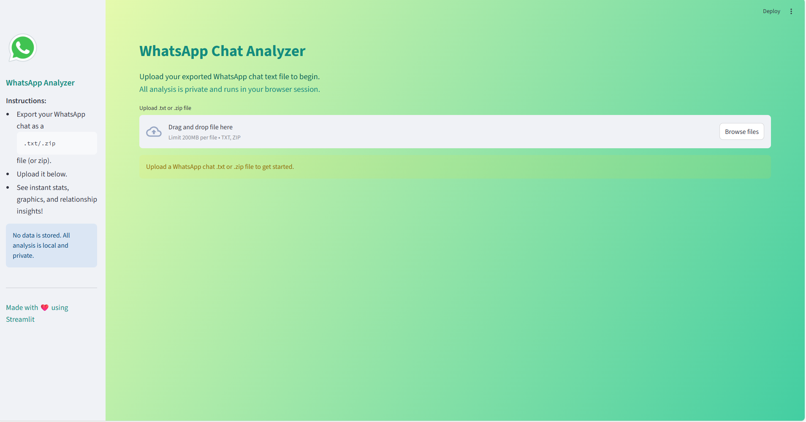
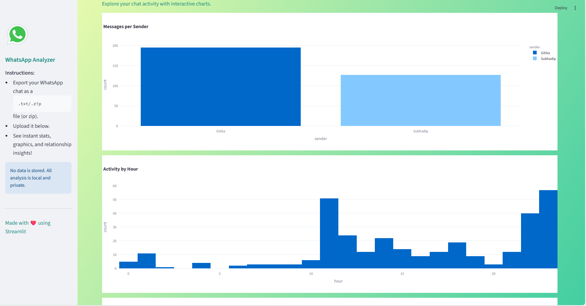

# 💬 WhatsApp Chat Analyzer

<p align="center">
  
  
  
  
</p>

> A beautiful Streamlit app to analyze WhatsApp chat exports, visualize activity, and get relationship insights with a modern UI.

---

## ✨ Features
- 📤 Upload WhatsApp chat `.txt` or `.zip` files
- 📊 See chat statistics (messages, participants, top chatter, etc.)
- 📈 Interactive visualizations (sender, hour, weekday)
- 👥 Chatter details: who talks most, first/last message, per-sender word stats
- ✨ Chatter characteristics: most common words, bigrams, trigrams, top words per sender
- 📝 Human summary: message balance, emoji use, activity, frequent topics
- 🖼️ Modern UI: sidebar help, color gradients, icons, and info
- 🔒 All analysis is local and private

---

## 🖥️ UI Preview
<p align="center">
  
  <br>
  
</p>

---

## 📁 Project Structure
```
whatsapp-analyzer/
│
├── app.py
├── requirements.txt
├── README.md
├── utils/
│   ├── parser.py
│   └── analyzer.py
├── assets/
│   ├── sample_chat.txt
│   ├── screenshot_main.png
│   └── screenshot_stats.png
```

---

## 🚀 Getting Started
1. **Install dependencies:**
   ```bash
   pip install -r requirements.txt
   ```
2. **Run the app locally:**
   ```bash
   streamlit run app.py
   ```
3. **Upload a WhatsApp chat `.txt` or `.zip` file** to explore stats and charts.

---

## ☁️ Deploy to Streamlit Cloud

1. [Sign up for Streamlit Cloud](https://streamlit.io/cloud)
2. Fork or upload this repo to your GitHub
3. In Streamlit Cloud, click **New app** and select your repo
4. Set the main file path to `app.py` and deploy!

---

## 🆘 How to Export WhatsApp Chat
- In WhatsApp, open the chat you want to export.
- Tap the three dots > More > Export chat.
- Choose **Without Media** for best results.
- Save the `.txt` file and upload it to the app.

---

## 🧾 Sample Chat
A sample chat file is provided in `assets/sample_chat.txt` for testing.

---

## 🛠️ Tech Stack
- Python 3.8+
- Streamlit
- Pandas, NLTK
- Plotly

---

## 📦 Optional Future Additions
- Sentiment analysis
- Emoji and word clouds
- PDF report export
- GPT-based recommendations

---

## ❤️ Credits
Made with [Streamlit](https://streamlit.io/) and open-source libraries.
